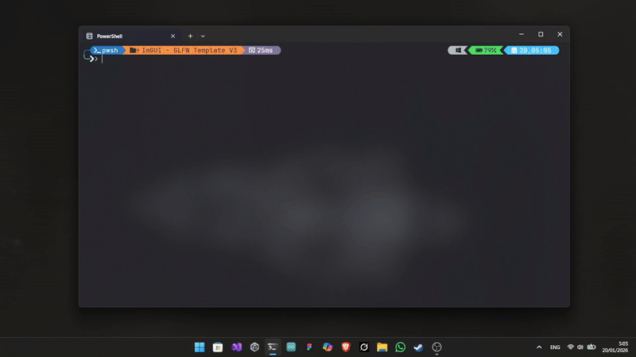

# Modern C++ Makefile Template

[](https://www.gnu.org/software/make/)

[](<https://en.wikipedia.org/wiki/C_(programming_language)>)
[](https://isocpp.org/)


[](https://learn.microsoft.com/en-us/cpp/)
[](https://clang.llvm.org/)
[](https://gcc.gnu.org/)

A clean, lightweight, and cross-platform **Makefile** for C++ projects.  
Supports Windows (**MinGW-w64/MSYS2**), **Linux**, and **macOS** with minimal configuration.

Designed to be simple, readable, and easy to extend, ideal for game engines, tools, small-to-medium applications, learning projects, or as a starting point.



## ⭐ Features

- ✅ **Cross-Platform**: Windows, Linux, macOS with automatic detection
- ✅ **Build Types**: Multiple configurations (release, debug, relwithdebinfo, analyze) with proper optimization levels
- ✅ **Architecture Optimization**: Architecture-specific optimization via `ARCH` variable (native, skylake, znver4, armv8-a, etc.)
- ✅ **Link-Time Optimization (LTO)**: Control LTO with `USE_LTO` flag (enabled by default in release builds)
- ✅ **Static Analysis**: Built-in `make analyze` target for static code analysis
- ✅ **Dependency Tracking**: Automatic `.d` file generation
- ✅ **Assembly Output**: Generate assembly files (`make asm`) and disassembly (`make disassemble`)
- ✅ **Parallel Builds**: Multi-core compilation support with automatic verbosity reduction
- ✅ **Sanitizers**: AddressSanitizer and UndefinedBehaviorSanitizer support in debug builds (Linux/macOS)
- ✅ **Improved UI**: Better build output with status indicators and build type information
- ✅ **Two Templates**: Basic (simple) and Advanced (feature-rich)

## 🚩 Quick Start - Run the Examples

In the root directory are a main **Makefile** for building two simple examples:

- **Spinning ASCII Donut**: A terminal-based 3D donut animation (in `examples/donut-basic/`)
- **ImGui + GLFW Demo**: A graphical window using ImGui and GLFW (in `examples/ImGui/`)

### Clone the repository

```bash
git clone https://github.com/DMsuDev/Basic-Makefile-Template.git
cd Basic-Makefile-Template
```

### Steps to build and run the examples:

```bash
# Option 1: View the spinning ASCII donut (terminal animation)
make run-donut

# Option 2: Open the ImGui window (graphical demo with GLFW)
make run-imgui

# Option 3: See available examples
make list

# Option 4: Get help
make help
```

**Note**: To run the ImGui example, copy the required `glfw3.dll` from the `lib/` folder to the `build/app/` directory after building.

**For help**: Type `make help` in the terminal to see all available commands.

## 📁 Build Output Structure (v1.0.3+)

```
project/
├── build/
│   ├── app/          ← Executables
│   ├── obj/          ← Object files (.o)
│   ├── dep/          ← Dependency files (.d)
│   └── asm/          ← Assembly files (.s) and disassembly
└── src/
```

> **Note**: In v1.0.2 and earlier, executables were in `build/bin/`. Update scripts if needed.

## Main Commands

| Command              | Description                               | When to use                           |
| -------------------- | ----------------------------------------- | ------------------------------------- |
| `make`               | Release build (default target)            | Everyday development                  |
| `make release`       | Explicit Release build with optimizations | Final/performance builds              |
| `make debug`         | Debug build + symbols + sanitizers        | Bug hunting, ASan/UBSan               |
| `make relwithdebinfo`| Release with debug info (best of both)    | Profiling with symbol debugging       |
| `make analyze`       | Static analysis build                     | Code quality checks                   |
| `make run`           | Release build + execute binary            | Quick testing                         |
| `make run-debug`     | Debug build + execute binary              | Debugging sessions                    |
| `make asm`           | Generate Intel-syntax `.s` assembly files | Inspecting compiler output            |
| `make disassemble`   | Disassemble final binary (objdump)        | Optimization / reverse engineering    |
| `make clean`         | Remove objects, deps, asm, binary         | Fresh start for current config        |
| `make clean-all`     | Delete entire `./build/` directory        | Changing compiler or major flags      |
| `make help`          | Show help message                         | Quick reference                       |
| `make info`          | Show project configuration summary        | Verify paths, compiler, sources count |

## 🚀 Parallel / Multi-Core Builds (Recommended for Speed)

The **Makefile** fully supports parallel compilation to use multiple **CPU cores** and dramatically reduce build times on modern machines.

### How to Use It

```bash
# Use all available cores (recommended)
make -j$(nproc) run     # Linux/WSL/macOS
make -j8 run            # Windows or fixed number (adjust to your CPU)

# Example: build with 8 cores (rule `all` by default)
make -j8

# Or with run
make run -j12
```

- **Automatic behavior**: When you use `-j` (parallel mode), the **Makefile** automatically reduces verbosity to avoid chaotic interleaved output.
  - No fancy colors or status icon per file
  - Only essential messages and errors are shown
  - This prevents the terminal from becoming a mess when compiling dozens/hundreds of files at once.

- **Note**: Start with `-j4` or `-j8` and increase until you find the sweet spot for your machine (too high can cause memory thrashing if RAM is limited).
- **On linux**: The verbose mode not deactivates automatically, so you can use `-s` to reduce output if needed.

## ⚙️ Customization

### Basic project settings

These variables control the behavior of the project and can be overridden directly from the command line:

| Variable         | Description                                    | Default       |
| ---------------- | ---------------------------------------------- | ------------- |
| **APP_NAME**     | Output executable name (no extension)          | `ProjectName` |
| **SRC_EXT**      | Source file extension                          | `cpp`         |
| **LANGUAGE**     | C/C++ standard                                 | `c++23`       |
| **CXX**          | Compiler to use                                | `g++`         |
| **USE_CONSOLE**  | Show console window on Windows                 | `true`        |
| **BUILD_TYPE**   | Build variant (release/debug/relwithdebinfo)   | `release`     |
| **USE_LTO**      | Enable Link-Time Optimization                  | `true`        |
| **ANALYZE**      | Enable static analysis flags                   | `false`       |
| **ARCH**         | Target architecture (`-march=`)                | `native`      |
| **LIBS**         | Libraries to link (`-l`)                       |               |
| **LDFLAGS**      | Library search paths (`-L`)                    | `-L./lib/`    |
| **SOURCE_DIRS**  | Source directories                             | `src include` |
| **INCLUDE_DIRS** | Include directories                            | `include`     |
| **OPT_RELEASE**  | Optimization flags (Release)                   | `-O3`         |
| **OPT_DEBUG**    | Optimization flags (Debug)                     | `-Og`         |

```bash
# Change app name
make APP_NAME=MyApp

# Use Clang++ and C++20 instead of G++ and C++23 (default values)
make CXX=clang++ LANGUAGE=c++20

# Build without console window on Windows
make release USE_CONSOLE=false

# Optimize for specific CPU architecture
make release ARCH=znver4          # AMD Zen 4
make release ARCH=skylake         # Intel 6th–9th gen
make release ARCH=armv8-a         # ARM (requires cross-compiler)

# Build with debug symbols and optimizations (best for profiling)
make relwithdebinfo

# Build with static analysis enabled
make ANALYZE=true release

# Debug build with all sanitizers and verbose output
make debug VERBOSE=1

# Release build without Link-Time Optimization (faster linking)
make release USE_LTO=false

# Parallel build with 8 cores (release configuration)
make -j8 release
```

### Adding libraries manually on Makefile (example: GLFW + OpenGL)

Uncomment/add in the libraries section:

```makefile
ifeq ($(OS),Windows_NT)
    LIBS += -lglfw3dll -lopengl32 -lgdi32
endif

ifeq ($(OS_NAME),Linux)
    LIBS += -lglfw -lGL -ldl -lpthread
endif

ifeq ($(OS_NAME),macOS)
    LIBS += -lglfw -framework OpenGL -framework Cocoa -framework IOKit -framework CoreVideo
endif
```

## 🗂️ Recommended Project Structure

```txt
MyProject/
├── src/
│   ├── main.cpp
│   ├── core/
│   │   └── engine.cpp
│   └── renderer/
├── include/
│   └── myproject/
├── lib/                  # optional: .a, .lib, .dll files
├── build/
│   ├── app/              # final executable
│   ├── obj/              # object files
│   ├── dep/              # .d dependency files
│   └── asm/              # assembly & disassembly output
└── Makefile
```

## 📦 Requirements

### 🪟 Windows

- MSYS2 (recommended): **UCRT64** or **MINGW64**
- Compilers: `g++` (MinGW‑w64) or `clang++`

### 🐧 Linux / WSL

- `gcc` or `clang`
- `make`
- Dev packages depending on your project (e.g., `build-essential`, `libglfw3-dev`, `libgl1-mesa-dev`)

### 🍎 macOS

- Xcode Command Line Tools: `xcode-select --install`
- Homebrew packages (optional): `brew install gcc clang`

### 🔧 Optional Tools

- `objdump` (for `make disasm`)
- `gdb` or `lldb` (debugging)
- `pkg-config` (optional)

## ⚠️ Troubleshooting

- **Linking errors on Linux** → Install missing dev packages (e.g., **libglfw3-dev** on **Ubuntu/WSL**)
- **`make` not found on Windows** → Use `mingw32-make` (included with **MinGW-w64**).
- **No rule to make target** → Verify source files exist in `src/` (or added folders)
- **Sanitizers not working on Windows** → Disabled by design (partial support in **MinGW**)
- **Double slashes in paths** → Usually harmless; caused by empty variables in some shells
- **Colors broken in CI** → Parallel mode auto-disables fancy output
- **Too much output with `-j`** → Use `-jN` `-s` or redirect to log
- **`clear` command not found (rare)** → On some Windows shells, fallback to `cls` happens automatically

---

**Note**: This project has been primarily developed and tested on **Windows** and **Linux/WSL**. Support for **macOS** is not guaranteed and may require adjustments.

If you encounter any issues, platform-specific bugs, or inconsistencies, **your feedback is extremely valuable.** 🙏

## 🤝 Contributing

Contributions, issues and feature requests are welcome. </br>
Feel free to check the issues page.

## 📜 License

[](LICENSE)

Happy coding! ❤️
